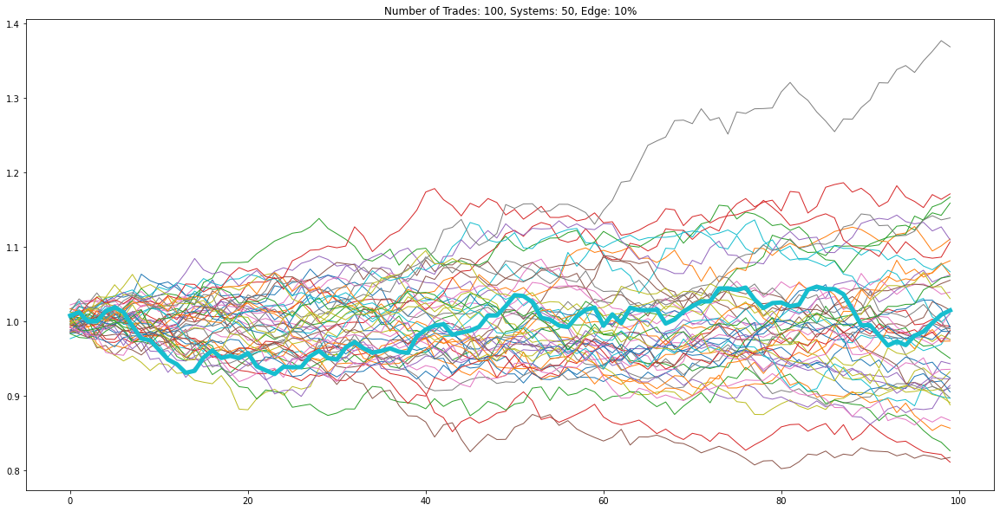
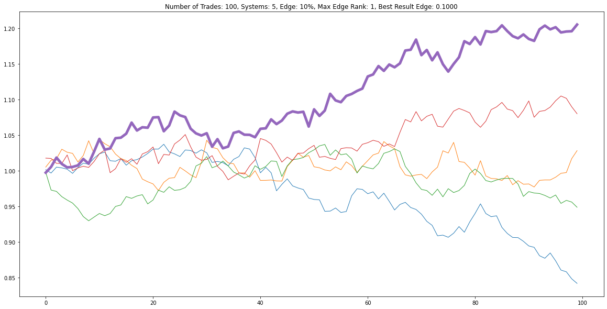
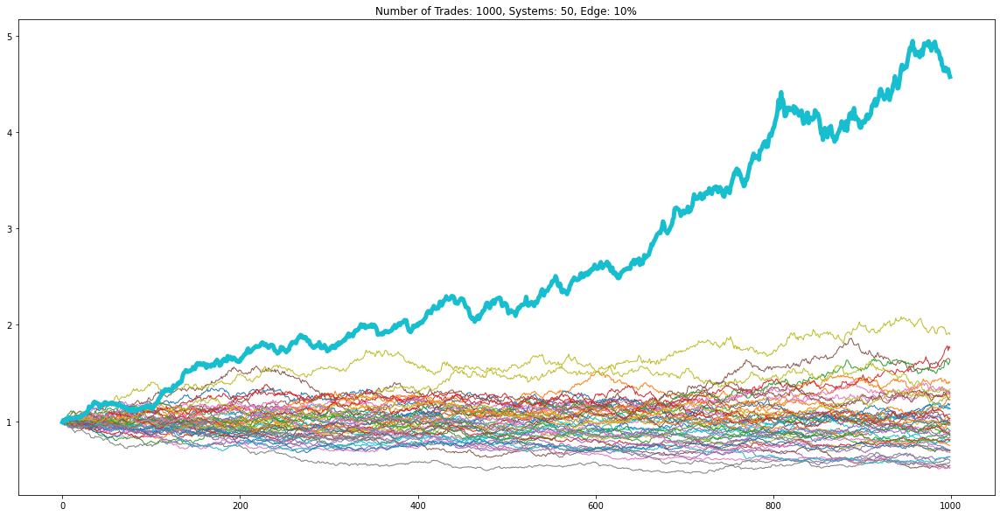

# 策略参数优化的统计功效分析

在进行策略的参数优化前，可以使用统计功效分析，确认优化的有效性。

## 统计显著性

我们在历史数据上进行策略的回测，从统计学的角度看，是根据样本推断总体特征。那么，我们就需要有足够的交易笔数才能认为回测结果是统计显著的，才有参考价值。

下图是三个参数优化的模拟结果，图中最粗的曲线是唯一有效的，胜率为60%，其他都是随机盈亏。







可以看到，图一有50组参数，经过了100次交易，最有效的参数组合在总体排名中处于中间位置。图二只有5组备选参数，经过同样的100次交易，有效参数略占优势。而图三同样有50组参数，经过1000次交易，最优参数组合遥遥领先。因此，在成交笔数相对参数数量不足的情况下，我们有一定概率选不到真正有效的参数。

多次模拟，图一、图二的结果可能会不同，但图三的中的有效策参数终可以显著跑赢其他参数。

## 统计功效分析

如果一个策略的参数组合中确实存在有效的的参数，那么通过统计功效分析可以估计出找到这个参数的概率，或者反过来，如果我们期望有95%的概率找到这个参数，那么需要满足哪些条件。

如果对统计功效感兴趣，推荐看一下这个[视频](https://www.youtube.com/watch?v=VX_M3tIyiYk)

在这里我们用模拟程序进行分析：

```python
import argparse
import timeit
import numpy as np
from numba import njit, prange


@njit
def run_sim(systems, trades, edge=0.1, pnl=0.01):
    """
    模拟多个参数组合的资金曲线，策略的胜率从-edge ~ edge
    :param systems: 参数数量
    :param trades: 交易次数
    :param edge: 最优参数的额外胜率
    :param pnl: 每次交易盈亏百分比的标准差
    :return: 实际最优参数的排名，回测结果最好参数的实际edge
    """

    # 参数1～N的盈利笔数
    win_rate_list = 0.5 + np.linspace(-1 * edge, edge, systems)

    res = []
    indexes = np.arange(0, trades)
    for i in range(systems):
        # 当前参数的盈利笔数
        current_win_rate = win_rate_list[i]
        current_win_num = int(current_win_rate * trades)

        # 生成符合正态分布的随机交易盈亏数据，负值
        equity_change = -1 * np.abs(np.random.normal(0, pnl, trades))
        # 按照胜率随机修改为盈利交易
        win_trades = np.random.choice(indexes, current_win_num, replace=False)
        equity_change[win_trades] = np.abs(equity_change[win_trades])

        # 计算资金曲线
        equity_curve = (1 + equity_change).cumprod()

        # 保存结果
        res.append(equity_curve[-1])

    res = np.array(res)
    sorted_res = np.argsort(res)[::-1]
    # 实际最优参数的排名
    max_edge_rank = np.argwhere(sorted_res == systems - 1)[0][0] + 1
    # 回测结果最好参数的实际edge
    best_edge = win_rate_list[sorted_res[0]] - 0.5

    return max_edge_rank, best_edge


@njit(parallel=True)
def run_multi_sim(times, systems, trades, edge, pnl):
    res = np.zeros((times, 2))
    for i in prange(times):
        max_edge_rank, best_edge = run_sim(systems, trades, edge, pnl)
        res[i, 0] = max_edge_rank
        res[i, 1] = best_edge
    return res


if __name__ == '__main__':
    parser = argparse.ArgumentParser(description='optimization power simulation')
    parser.add_argument('-n', '--times', type=int, default=10000, help='simulation times, default: 10000')
    parser.add_argument('-s', '--systems', type=int, default=50, help='number of systems, default: 50')
    parser.add_argument('-t', '--trades', type=int, default=200, help='trade times, default: 200')
    parser.add_argument('-e', '--max-edge', type=float, default=0.1, help='max edge, default: 0.1')
    parser.add_argument('-c', '--pnl', type=float, default=0.01, help='standard deviation of profit and loss rate of each trade, default: 0.01')
    args = parser.parse_args()

    print(f'Run simulation with arguments: {args}')
    start_time = timeit.default_timer()
    results = run_multi_sim(args.times, args.systems, args.trades, args.max_edge, args.pnl)

    rank_res = results[:, 0]
    rank_mean = np.mean(rank_res)
    rank_std = np.std(rank_res)
    edge_res = results[:, 1]
    edge_mean = np.mean(edge_res)
    edge_std = np.std(edge_res)
    prob = rank_res[rank_res <= 3].shape[0] / edge_res.shape[0]
    print(f'rank mean: {rank_mean:.2f}, std: {rank_std:.4f}, top 3 probability: {prob * 100:.2f}%')
    print(f'edge mean: {edge_mean:.4f}, std: {edge_std:.4f}')

    elapse = timeit.default_timer() - start_time
    print(f'done, takes {elapse:.2f}s')
```

程序通过进行多次优化模拟，得到最优参数排名与排名第一参数的实际有效性的统计数据。模拟的参数不只有唯一的一组有效，而是均匀分布在[-edge, edge]之间，为了计算方便，策略的edge体现在胜率上，并且没有计算交易手续费。

下边以少年意气篇3.3.8遍历策略参数为例，其参数组合总数为均线长度`range(10, 1000, 10)`共99个参数，标准差`[i / 10 for i in list(np.arange(5, 50, 1))]`共45个参数，两者相乘，共4455个参数，在历史数据上回测的交易笔数为199。策略的最大edge假设为10%。

```shell
> python stats_power_sim.py -n 10000 -s 4455 -t 199 -e 0.1

Run simulation with arguments: Namespace(max_edge=0.1, pnl=0.01, systems=4455, times=10000, trades=199)
rank mean: 332.31, std: 320.6291, top 3 probability: 1.49%
edge mean: 0.0918, std: 0.0079
done, takes 96.29s
```

经过10000次模拟之后，可以看到最优参数的排名平均在332名，进入前三的概率只有1%，很难被选到，但是选到的参数大概率可以有9%的edge。 

模拟并不能确定这个策略有效，因为我们模拟的假设是策略存在10%的edge，以及策略的edge均匀分布，这个假设可能不成立。

通过使用不同的参数进行模拟，我们可以得到一些策略优化的方向： 减少优化参数的数量、增加成交笔数。另外，如果一个策略较好，edge较大，那么对成交笔数的要求就相对较低。